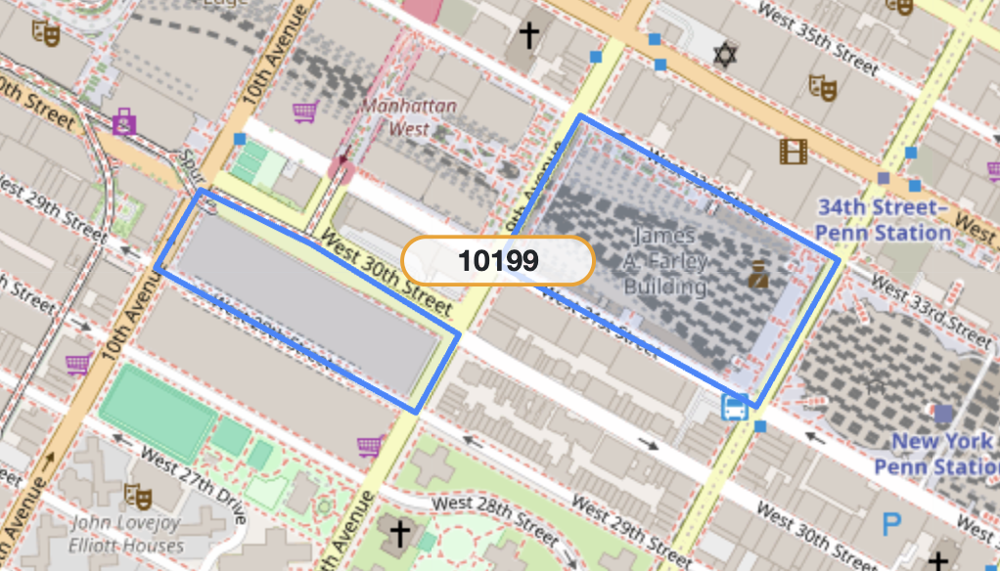

## Problem 1

### 1. Load required libraries
```{r, message = FALSE}
library(tidyverse)
library(lubridate)
```

### 2. Load the dataset
```{r, message = FALSE}
pols_month <- read_csv("fivethirtyeight_datasets/pols-month.csv")
snp <- read_csv("fivethirtyeight_datasets/snp.csv")
unemployment <- read_csv("fivethirtyeight_datasets/unemployment.csv")
```

### 3. Clean the data in pols-month.csv
```{r}
#Quickly view the data
glimpse(pols_month)

pols_clean <- pols_month %>% 
  separate(mon, 
           into = c("year","month","day"),
           sep = "-"
           ) %>% 
  mutate(
    month = as.numeric(month),
    month = month.name[month],
    year = as.numeric(year),
    day = as.numeric(day)
  ) %>% 
  mutate(president = ifelse(prez_gop == 1, "gop", "dem")) %>% 
  select(-prez_gop, -prez_dem, -day)

view(pols_clean)
```

### 4. Clean the data in snp.csv
```{r}
#Quickly view the data
glimpse(snp)

snp_clean <-snp %>% 
  separate(date, 
           into = c("month","day","year"),
           sep = "/"
           ) %>% 
  mutate(
    month = as.numeric(month),
    month = month.name[month],
    year = as.numeric(year),
    year = ifelse(year < 50, 2000 + year, 1900 + year),
    day = as.numeric(day)
  ) %>% 
  select(year, month, close) %>% 
  arrange(year, month)
  
view(snp_clean)
```

### 5. Tidy the unemployment data
```{r}
unemployment_clean <- unemployment %>% 
  pivot_longer(
    cols = Jan : Dec,
    names_to = "month",
    values_to = "unemployment_rate"
  ) %>% 
  mutate(
    month = case_when(
      month == "Jan" ~ "January",
      month == "Feb" ~ "February",
      month == "Mar" ~ "March",
      month == "Apr" ~ "April",
      month == "May" ~ "May",
      month == "Jun" ~ "June",
      month == "Jul" ~ "July",
      month == "Aug" ~ "August",
      month == "Sep" ~ "September",
      month == "Oct" ~ "October",
      month == "Nov" ~ "November",
      month == "Dec" ~ "December"
    )
  ) %>% 
  select(year = Year, month, unemployment_rate) %>% 
  arrange(year, month)

view(unemployment_clean)
```

### 6. Join the datasets
```{r}
merged_data <- left_join(pols_clean, snp_clean, by = c("year","month"))
final_data <- left_join(merged_data, unemployment_clean, by= c("year","month"))

view(final_data)
```

### 7. Description

* The **"pols_clean"** dataset contains monthly data related to American politics, spanning from 1947 to 2015, with a total of 822 rows of observational data. It specifically includes the number of Democratic and Republican politicians (including governors, senators and representatives) at different times, as well as the party information of the president. The key variables include the number of Republican governors (`gov_gop`), the number of Republican senators (`sen_gop`), the number of Republican representatives (`rep_gop`), the number of Democratic governors (`gov_dem`), the number of Democratic senators (`sen_dem`), the number of Democratic representatives (`rep_dem`), and the presidential party (`president`).

* The **"snp_clean"** dataset contains monthly closing price data of the S&P index, spanning from 1950 to 2015, with a total of 787 rows of observational data. The key variable is the closing price (`close`).

* The **"unemployment_clean"** dataset contains monthly unemployment rate data in the United States, spanning from 1948 to 2015, with a total of 816 rows of observational data. The key variable is the unemployment rate (`unemployment_rate`).

* **"final_data"** contains all the information of the above three datasets, including 11 variables and 822 rows of observational data, spanning from 1947 to 2015. It provides a reference basis for analyzing the historical development of the United States from three dimensions: politics, economy, and employment. Due to the inconsistent time spans of various datasets, there are some missing values after merging.

## Problem 2

### 1. Load required libraries
```{r, message = FALSE}
library(readxl)
```

### 2. Read and clean the Mr. Trash Wheel sheet
```{r, message = FALSE}
#Specify the sheet in the Excel file and to omit non-data entries
mr_trash <- read_excel("202409 Trash Wheel Collection Data.xlsx", sheet = "Mr. Trash Wheel", skip = 1, range = cell_cols("A:N")) %>% 
  #Use reasonable variable names
  janitor::clean_names() %>% 
  #Omit rows that do not include dumpster-specific data
  filter(!is.na(dumpster)) %>% 
  #Round the number of sports balls to the nearest integer and converts the result to an integer variable
  mutate(
    sports_balls = as.integer(round(sports_balls)),
    year = as.character(year)
    ) %>% 
  #Add an additional variable to keep track of which Trash Wheel is which
  mutate(trash_wheel = "Mr. Trash Wheel") %>% 
  select(trash_wheel,everything())

view(mr_trash)
```

### 3. Read and clean the Professor Trash Wheel sheet
```{r, message = FALSE}
professor_trash <- read_excel("202409 Trash Wheel Collection Data.xlsx", sheet = "Professor Trash Wheel", skip = 1) %>%
  janitor::clean_names() %>%
  filter(!is.na(dumpster)) %>%
  mutate(
    trash_wheel = "Professor Trash Wheel",
    year = as.character(year)
    ) %>% 
  select(trash_wheel,everything())

view(professor_trash)
```

### 4. Read and clean the Gwynnda Trash Wheel sheet
```{r, message = FALSE}
gwynnda_trash <- read_excel("202409 Trash Wheel Collection Data.xlsx", sheet = "Gwynnda Trash Wheel", skip = 1) %>%
  janitor::clean_names() %>%
  filter(!is.na(dumpster)) %>%
  mutate(
    trash_wheel = "Gwynnda Trash Wheel",
    year = as.character(year)
    ) %>% 
  select(trash_wheel,everything())

view(gwynnda_trash)
```

### 5. Combine these datasets to produce a single tidy dataset
```{r}
combined_trash <- bind_rows(mr_trash, professor_trash, gwynnda_trash) %>%
  #Make sure the date format is consistent
  mutate(date = as.Date(date))

view(combined_trash)
```

### 6. Description

* The above three datasets record the garbage collection situations of three garbage collection boats (Mr. Trash Wheel, Professor Trash Wheel and Gwynnda) in the Inner Harbor of Baltimore. The merged dataset contains a total of `r nrow(combined_trash)` observations, and each observation represents a trash can collection record. The key variables include the `trash_wheel` identification of the garbage collection vessel, the `dumpster` number, the collection `date`, the `weight_tons` weight of the garbage, and the `volume_cubic_yards` volume. Unit: cubic yards), quantities of various types of garbage (such as plastic bottles `plastic_bottles`, `polystyrene`, cigarettebutts `cigarette_butts`, glass bottles `glass_bottles`, plastic bags `plastic_bags`, packaging bags `wrappers`, etc.) And the number of households powered based on garbage weight calculation (`homes_powered`).

* According to the available data, the total weight of the garbage collected by Professor Trash Wheel was `r sum(combined_trash$weight_tons[combined_trash$trash_wheel == "Professor Trash Wheel"], na.rm = TRUE)` tons. The total number of cigarette butts collected by Gwynnda in June 2022 was `r sum(combined_trash$cigarette_butts[combined_trash$trash_wheel == "Gwynnda Trash Wheel" & combined_trash$year == "2022" & combined_trash$month == "June"], na.rm = TRUE)`.

## Problem 3

### 1. Read and clean the zip dataset
```{r, message=FALSE}
zip <- read_csv("zillow_data/Zip Codes.csv") %>% 
  janitor::clean_names() 

view(zip)
```


### 2. Read and clean the zori dataset
```{r, message=FALSE}
#Create a borough mapping table
borough_mapping <- data.frame(
  county = c("New York", "Kings", "Queens", "Bronx", "Richmond"),
  borough = c("Manhattan", "Brooklyn", "Queens", "Bronx", "Staten Island")
)

zori <- read_csv("zillow_data/Zip_zori_uc_sfrcondomfr_sm_month_NYC.csv") %>% 
  janitor::clean_names()

zillow_data <- zori %>% 
  rename(zip_code = region_name) %>% 
  pivot_longer(
    cols = matches("^x\\d{4}_\\d{2}_\\d{2}$"),
    names_to = "date",
    values_to = "zori"
  ) %>%
  mutate(date = str_remove(date, "^x") %>% 
         str_replace_all("_", "-") %>% 
         ymd()) %>% 
  left_join(
    zip,
    by = "zip_code",
    relationship = "many-to-many"
  ) %>% 
  left_join(borough_mapping, by = "county") %>% 
  select(-county_name)

view(zillow_data)
```

### 3. Description

The tidy dataset contains `r nrow(zillow_data)` total observations, 
covering `r dplyr::n_distinct(zillow_data$zip_code)` unique ZIP codes 
and `r dplyr::n_distinct(zillow_data$neighborhood, na.rm = TRUE)` unique neighborhoods.

### 4. ZIP codes that were excluded
```{r}
missing_zips <- setdiff(zip$zip_code, unique(zori$region_name))

missing_zips
```

* According to the introduction of the zori dataset, ZORI is the Zillow Observed Rent Index, and its characteristics are:

  * Only cover residential areas with an active rental market.

  * The calculation is based on the listed rent data and only takes the middle rent range from the 35th to the 65th percentile.

  * A sufficient number of listing samples are needed to generate stable indicators.

* Therefore, the main reasons for some ZIP files being missing are as follows:

  * ZIP for non-residential use

  * Insufficient sample size/No listing

  * Atypical housing market

  * Data quality considerations

For example, according to online information, the ZIP code 10045 is exclusive to the Federal Reserve Bank building:


The ZIP code 11430 is JFK airport. There is basically no housing here.


The zip code 10199 is for USPS facilities:



### 5. Fluctuating rental prices
```{r}
price_change <- zillow_data %>%
  filter(date %in% c(ymd("2020-01-31"), ymd("2021-01-31"))) %>%
  select(zip_code, date, zori, borough, neighborhood) %>%
  group_by(zip_code, date, borough, neighborhood) %>%
  summarize(zori = mean(zori, na.rm = TRUE), .groups = "drop") %>%
  pivot_wider(
    names_from = date,
    values_from = zori
  ) %>%
  # Calculate the decline in rent (use backticks for column names with special characters)
  mutate(drop = `2020-01-31` - `2021-01-31`) %>%
  # Sort by the largest to the smallest decline
  arrange(desc(drop)) 
  
head(price_change, 10)
```

* From January 2020 to January 2021, all the top ten boroughs with the largest rent declines were in **Manhattan**, indicating that the core area of Manhattan was the most severely affected during the pandemic. It mainly focuses on several neighborhoods: Lower Manhattan (10007, 10004, 10038), Lower East Side (10009, 10002), Gramercy Park and Murray Hill (10016) 10010), Chelsea and Clinton (10001), Greenwich Village and Soho (10012). 

* Its decline was between 680 and 910 US dollars, with the maximum drop being in 10007, a decrease of approximately 913 dollars. 

* The main reason for the impact on Manhattan might be the remote working during the pandemic, which led to a sharp decline in rental demand in business districts and an oversupply in the high-end rental market.
